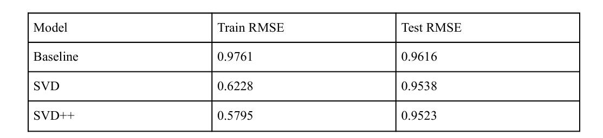

# Hybrid Recommendation System
 Hybrid User based Collaborative Filtering and Graph based Product Recommendation System.
 In the contemporary digital landscape, Recommendation Systems (RS) have emerged as
 indispensable tools, transforming the way users interact with online platforms. These systems, rooted in
 information filtering, are designed to suggest the most pertinent content to users, fostering engagement
 and enhancing user experience. The essence of a robust RS lies in its ability to understand user
 preferences and tailor recommendations accordingly, thereby establishing a crucial link between
 consumers and products.

 Amazon, as a prime example, has an extensive and diverse product catalog, where users
 might find themselves overwhelmed by choices or, conversely, unable to discover products that align
 with their preferences. A sophisticated recommendation system not only assists users in navigating this
 vast array of options but also ensures that users discover products that resonate with their preferences
 and needs. Consequently, such a system becomes integral to Amazon's ability to not only attract but
 retain users in the fiercely competitive e-commerce landscape.

 By leveraging the extensive Amazon review and product metadata dataset, we aim to
 build a Recommendation System that combines User-based Collaborative Filtering with Graph-based
 techniques, as proposed by A. Effron et.al. in [1]. By combining various recommender algorithms, we
 aim to not only address the challenges posed by individual algorithms but also to create a comprehensive
 system capable of delivering accurate and tailored product recommendations, thereby elevating the user
 experience on the Amazon platform.

  

# Dataset
 For our project, we utilized a comprehensive Amazon review dataset compiled in 2018,
 encompassing over 500,000 reviews contributed by more than 100,000 users. This dataset,
 generously made available by Jianmo Ni, features key attributes such as 'userName,' 'verified,'
 'itemName,' 'description,' 'image,' 'brand,' 'feature,' 'category,' 'price,' 'rating,' 'reviewTime,'
 'summary,' 'reviewText,' and 'vote.' Our analysis focused on a subset of 10,000 rows from this
 dataset.

 To refine the data, we performed text preprocessing on specific columns ('description,'
 'summary,' 'reviewText'), employing techniques such as lowercase conversion, punctuation
 removal, tokenization, stopword removal, and lemmatization. Categorical data in 'userName' and
 'itemName' underwent conversion into numerical format, with additional steps like data scaling and
 label encoding applied to the 'brand' column. 
 
 To establish a balanced dataset, we examined the distribution of items rated or reviewed by users and implemented filtering criteria, excluding users
 who rated over 50 items or fewer than 5 items. Following this preprocessing, the dataset retained
 1,928 users, each contributing an average of 8.56 rated items. This ensures the dataset's suitability
 for constructing and evaluating a robust Hybrid User-based Collaborative Filtering and
 Graph-based Product Recommendation System.

 # Collaborative Filtering

Collaborative Filtering is a common technique used when it comes to building intelligent
 recommender systems that can learn to give better recommendations as more information about
 users is collected. It is a technique that can filter out items that a user might like based on reactions
 by similar users.

 The memory-based approach involves finding users similar to the target user who have
 rated the item and calculating the rating by considering their preferences. To find the similarity
 between any two users, we used the cosine of the angle and predicted a user’s rating R for an item I
 would be close to the average of the ratings given to I by the top 5 or top 10 users most similar to
 user U.

The mathematical formula for the average rating given by n users would look like this:

  

  The model-based approach,on the other hand,employs singular value decomposition
 (SVD) to compress the large user-item matrix,improving efficiency in terms of space and time. If
 the matrix is mostly empty,reducing dimensions can improve the performance of the algorithm in
 terms of both space and time. Matrix factorization can be seen as breaking down a large matrix into
 a product of smaller ones.The accuracy of the model is evaluated using RootMeanSquareError
 (RMSE),comparing predicted and true ratings for a test dataset. To address the cold start problem,
 where a user has not rated any products,we recommend the top 10 items by popularity. This
 collaborative filtering approach ensures a nuanced and accurate recommendation system tailored to
 user preferences and interactions.
 

  

  

  

# Graph Creation

In this project, we use a bipartite graph to represent user-product interactions [1] which
 focuses on positive user experiences, providing a robust foundation for the recommendation system
 Nodes: Users and products.
 Edges: Formed only when a user has given a product a rating above 3.5.

  

 # Community-Specific recommendations

  The dataset lacks explicit user-user interactions, posing a challenge in determining user
 similarities and preferences. To address this, we construct a folded graph [5] by projecting a
 bipartite graph, which effectively captures user-product interactions. The edge weight in this graph
 is determined using the Jaccard similarity index, calculated as the ratio of the number of co-reviews
 to the total number of reviews for each pair of users. This approach allows us to infer implicit
 user-user relationships based on shared product interests and enables us to generate
 recommendations that resonate deeply with each community's unique taste and preference patterns.
 To implement this, we follow a structured process:
 1. Refining User Connections: Set a threshold 't' for user connections based on co-reviewed
 products to filter the edges. Use the Louvain algorithm [5] for community detection,
 grouping users who co-reviewed more than 't' products, indicating similar preferences.

  

2. Generating a Refined Product Set: Within each community, identify a set of products rated
 highly (≥ 3.5) by community members, as extracted from the bipartite graph.

3. Scoring Products in the Refined Set:
 Calculate product scores based on:

 > Frequency (f): How often a product is purchased within the community.

 > Product Centrality (c): The product's importance in the bipartite graph.

 > UserReviews (v * r): A combined metric [1] of product ratings and vote counts.

 Use the formula product score:
 w1 *(1/f * sum(vote * rating)) + w2 * log(f) + w3 * c, with weights (w1, w2, w3) for each
 factor.

 ### Validation Steps:
 1. Data Splitting: The edges of the original bipartite graph are divided into training (80%),
 validation (10%), and test (10%) sets.
 2. Weight Optimization: Utilizing a grid sweep method, the weights in the scoring formula are
 optimized against the validation set

# Product Bipartite Graph with Random Walks

Asignificant challenge arises in the previous approach when users are isolated with a
 community size of zero, making it difficult to generate recommendations based on community
 preferences. Out of the 142 communities that this model identifies, 46 contained only one user. To
 overcome this, we propose an approach that predicts recommendations based on a products
 description and summary.

 A. Creation of the Bipartite Graph

 After preprocessing, we perform NLP techniques and extract keywords from product description
 and summary. We utilize the tokenized and clean keywords from description text and summary
 along with categories of each product to construct a bipartite graph with two layers:
 Layer 0: Contains product IDs.
 Layer 1: Features keywords extracted from the product's description and summary + categories
 To ensure a balanced recommendation system, the graph's edges are weighted inversely
 proportional to the frequency of categories and keywords. This weighting strategy reduces the
 influence of common categories and keywords, while amplifying rarer ones, thus preventing bias
 towards popular items. Categories are given ten times more weightage, acknowledging their
 significance in identifying similar products.

 B. Random Walk for Recommendations

 Weinitiate a Random Walk on this graph from a product for which a user has given a rating greater
 than 3.5. The walk, set to a path length of 10,000 steps, navigates through the bipartite structure,
 exploring connections between products and their descriptive features. The output of the random
 walk, comprising product IDs, categories, and keywords, is filtered to retain only the product IDs.
 Further, using sklearn's CountVectorizer, we analyze the frequency of the retained product IDs.
 This analysis allows us to identify and recommend the top 5 items, either from the category the
 user searched for or the most frequently bought items. This method combines the user's explicit
 preferences (through their high ratings) with implicit similarities drawn from the product
 descriptions, providing a nuanced and user-centric recommendation system

 # Node2vec Product Similarity

 Finally, we delve into the application of Node2vec for product similarity. The
 implementation for this was described by A. Effron et al. [1]. A recommendation system based on
 product similarity was developed by Amazon. In a system where there are more users than
 products, product-based filtering is faster and more stable than user-based. It is effective because
 usually, the average rating received by an item doesn’t change as quickly as the average rating
 given by a user to different items. In our model, we leverage Node2vec embeddings as a proxy for product profiles. 
 
 By calculating the similarity to a user's historical purchases based on these
 embeddings, we can effectively recommend products aligned with their preferences.
 Our model implementation follows a systematic process leveraging the Node2vec
 algorithm on the user-item bipartite graph. Executing 100 random walks per node, we prioritize
 capturing intricate relationships within the graph. Notably, we set the parameter q>p, which
 provides a nuanced perspective on the graph, ensuring that nodes with similar network roles exhibit
 more comparable embeddings, offering a microscopic view of the underlying product relationships.
 After obtaining the Node2vec embeddings for product nodes, we normalize them for consistency in
 subsequent computations.

 To generate initial recommendations, we compute cosine similarity scores between the
 embeddings of products. For each user u, we identify the products Pu they have reviewed. From this
 set, we extract the top 10 similar products, aggregating them into Purecommended.
 Taking into account user interactions, we update the similarity scores in Purecommended based
 on the sum of similarities to products in Pu . This adjustment ensures that the recommendations are
 not only similar in general terms but also tailored to the user's specific preferences. Subsequently,
 we refine recommendations by removing products present in Pu from Purecommendedand sorting the
 remaining products by the updated similarity scores. The final step involves recommending the top
 |recSize| products from Purecommended for each user u, providing a personalized and optimized product
 recommendation tailored to individual user preferences.

 

  

 

  

# Evaluations

 To assess the effectiveness of our recommendation system, we employ several key metrics: Recall,
 Precision, and the F1 Score. Each of these metrics provides valuable insights into different aspects
 of the system's performance, allowing for a comprehensive evaluation.

 <b>Recall: Measuring Coverage of Relevant Recommendations</b>

 Recall is calculated as the proportion of actual relevant items that are recommended by our system.
 It's a measure of the system's ability to identify and recommend all relevant products to a user.
 Recall = Number of Products Predicted for User u /Total User-Item Edges in Test Set.

 <b>Precision: Assessing the Accuracy of Recommendations</b>

 Precision evaluates how many of the recommended items are relevant to the user.
 Precision = User-Item Edges where Item is in Recommended Set / No. of Users×Recommended
 Set Size

 <b> F1 Score: Balancing Precision and Recall </b>
 The F1 Score is the harmonic mean of precision and recall, providing a single metric that balances
 both aspects. It's especially useful when we want to find a balance between recommending as many
 relevant items as possible (recall) and ensuring that the items recommended are indeed relevant
 (precision).

 

 F1 Score = 2×Precision×Recall /Precision + Recall

 This metric offers a comprehensive view of the system's performance, factoring in both the breadth
 and accuracy of the recommendations.

  

  

# Conclusion

 This project has made significant strides in advancing recommendation systems using
 collaborative filtering and bipartite graph structures. Collaborative filtering emerges as a robust
 recommendation approach that thrives on its independence from known features about items or
 users. By recommending items that diverge from the user's previous selections, it introduces a
 valuable element of diversity to the recommendations.

 By focusing on community-specific recommendations and employing random walks for
 user-item interactions, the system demonstrates a sophisticated approach to tailoring product
 suggestions based on implicit and explicit user preferences. Finally, Node2vec embeddings were
 used as a proxy for product profiles, and similarities to embeddings of a target user's past purchases
 were used to recommend potential products.

 The evaluation metrics– Recall, Precision, and F1 Score– highlight the system's
 capability to provide relevant and accurate recommendations. In certain e-commerce contexts,
 achieving high precision and recall scores can be challenging. Users in these scenarios may value a
 blend of relevant and diverse recommendations. While the model may not boast exceptional
 precision and recall, it excels in providing users with a curated mix that balances relevance and
 diversity. This approach acknowledges the complexity of user preferences, catering to a spectrum
 of interests and enhancing overall satisfaction in interacting with Amazon e-commerce.

 # Future Scope

Looking forward, there are several avenues for further enhancing the recommendation system:
 1. Optimizing the Bipartite Graph: The current bipartite graph, while effective, is quite dense.
 Future work could involve implementing techniques to prune less important nodes, thereby
 differentiating between direct and indirect connections. This refinement could lead to more
 accurate recommendations by focusing on the most significant user-item interactions.
 2. Enhancing User Profile Specialization: The current system could be further refined by
 incorporating additional features about the items or users. By building a more detailed user
 profile and considering a wider range of item attributes, the recommender system can
 achieve a higher degree of personalization. This approach would cater more precisely to
 individual user preferences and potentially uncover subtle patterns in user behavior.
 3. Expanding to Diverse Data Sources: Integrating data from diverse sources could enrich the
 recommendation process. For instance, considering user-generated content, social media
 activity, or temporal dynamics in user behavior might unveil new dimensions for more
 nuanced recommendations.

 # References

  [1] A. Effron, K. Shen, and R. Mui, "Graph-based recommendation of Amazon products, Stanford
 Network Analysis Project 2018.

 [2] D. Goldberg, D. Nichols, B. M. Oki, and D. Terry, “Using collaborative filtering to weave an
 information tapestry,” Communications of the ACM, vol. 35, no. 12, pp. 61–70, Dec. 1992.

 [3] A. Effron, K. Shen, and R. Mui, "Graph-based recommendation of Amazon products",
 Stanford Network Analysis Project 2018.

 [4] Wang, S., Hu, L., Wang, Y., He, X., Sheng, Q. Z., Orgun, M. A., Cao, L., Ricci, F., & Yu, P. S.
 (2021). Graph Learning based Recommender Systems: A Review. ArXiv. /abs/2105.06339

 [5] V. D. Blondel et al., "Fast unfolding of communities in large networks," Journal of Statistical
 Mechanics: Theory and Experiment, vol. 2008, no. 10, p. P10008, 2008